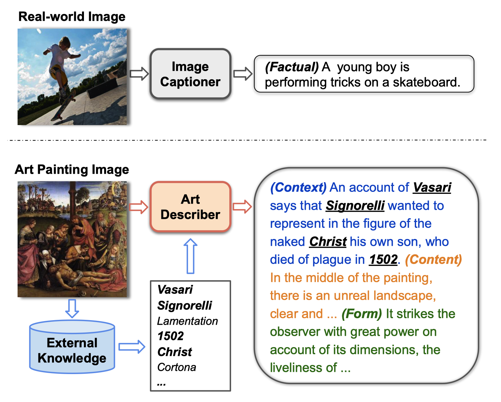
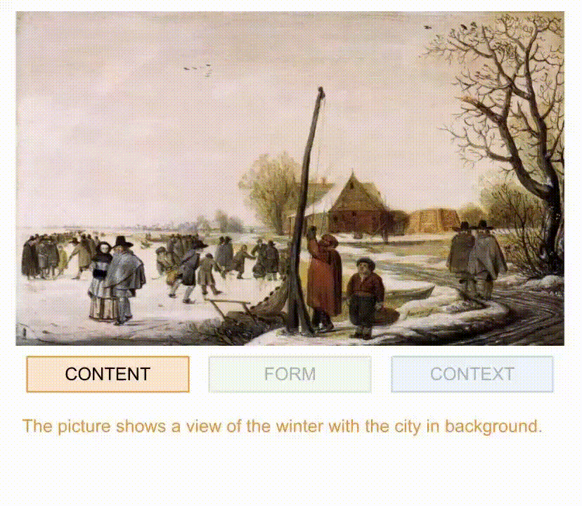
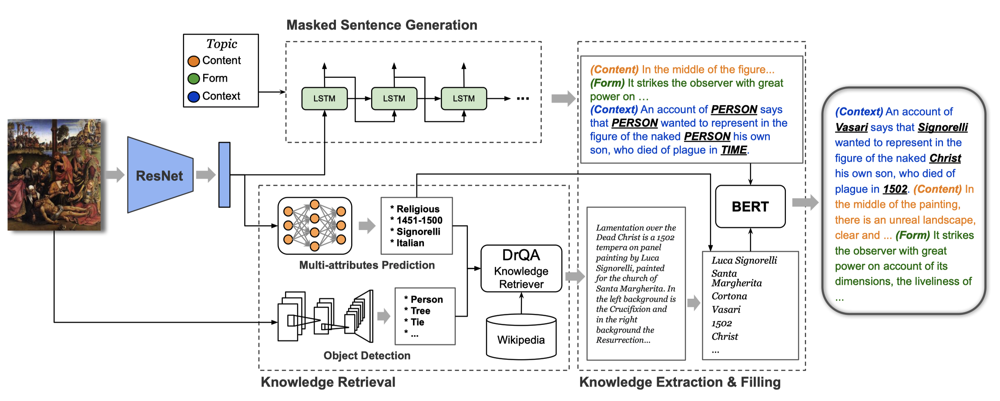

# Explain Me the Painting: Multi-Topic Knowledgeable Art Description Generation

#### [[Code]](https://github.com/JosephPai/Art-Description) [[Data]](https://github.com/noagarcia/explain-paintings) [[Project Page]](https://sites.google.com/view/art-description-generation)

Official PyTorch Implementation of our paper [Explain Me the Painting: Multi-Topic Knowledgeable Art Description Generation](https://arxiv.org/abs/2109.05743), published at [ICCV 2021](http://iccv2021.thecvf.com/).

 

> Have you ever looked at a painting and wondered what is the story behind it? This work presents a framework to bring art closer to people by generating comprehensive descriptions of fine-art paintings. Generating informative descriptions for artworks, however, is extremely challenging, as it requires to 1) describe multiple aspects of the image such as its style, content, or composition, and 2) provide background and contextual knowledge about the artist, their influences, or the historical period. To address these challenges, we introduce a multi-topic and knowledgeable art description framework, which modules the generated sentences according to three artistic topics and, additionally, enhances each description with external knowledge. The framework is validated through an exhaustive analysis, both quantitative and qualitative, as well as a comparative human evaluation, demonstrating outstanding results in terms of both topic diversity and information veracity.



## Setup

### Requirements
The code are tested under Python3.6 with the following packages:
````
torch==1.1.0
torchvision==0.2.2
numpy==1.16.2
visdom==0.1.8.9
transformers==2.1.1
nltk==3.2.3
stanfordcorenlp==3.9.1.1
scipy==1.3.1
pandas==0.25.1
````

### Prepare Data

1.Download the dataset from this [repository](https://github.com/noagarcia/explain-paintings)

2.Put the `annotation` folder into the `MaskedSentenceGeneration`

### Masked Sentence Generation
````
cd MaskedSentenceGeneration
python prepare_dataset.py
bash train.sh
bash test_one.sh / bash test_all.sh
````

### Knowledge Retrieval
Please look into [here](./KnowledgeRetrieval/README.md)

### Knowledge Filling
````
cd KnowledgeFilling
python create_dataset_drqa_src.py
bash train.sh
bash test.sh
````

## Citation

If you find the data in this repository useful, please cite our paper:
````
@InProceedings{bai2021explain,
   author    = {Zechen Bai and Yuta Nakashima and Noa Garcia},
   title     = {Explain Me the Painting: Multi-Topic Knowledgeable Art Description Generation},
   booktitle = {International Conference in Computer Vision},
   year      = {2021},
}
````
